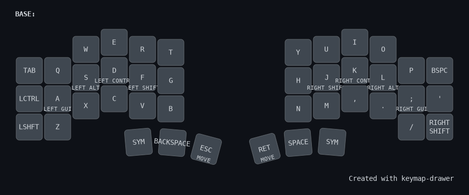
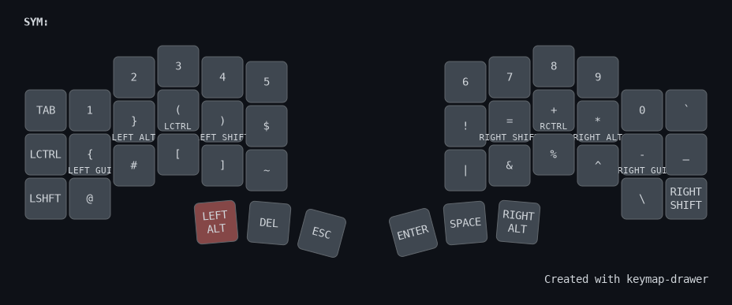
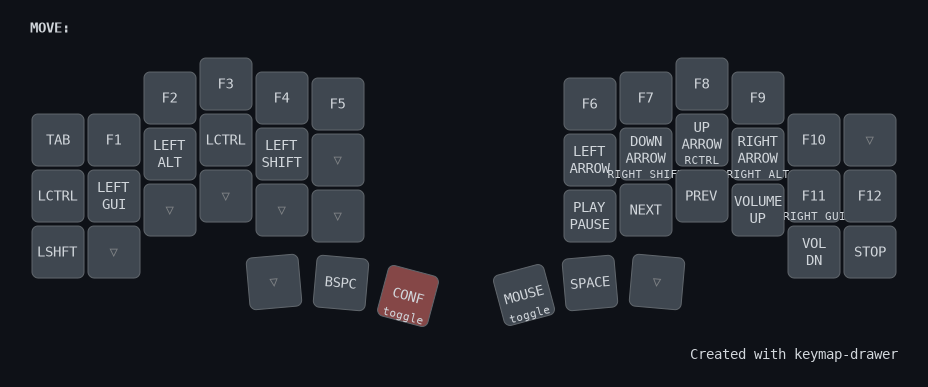
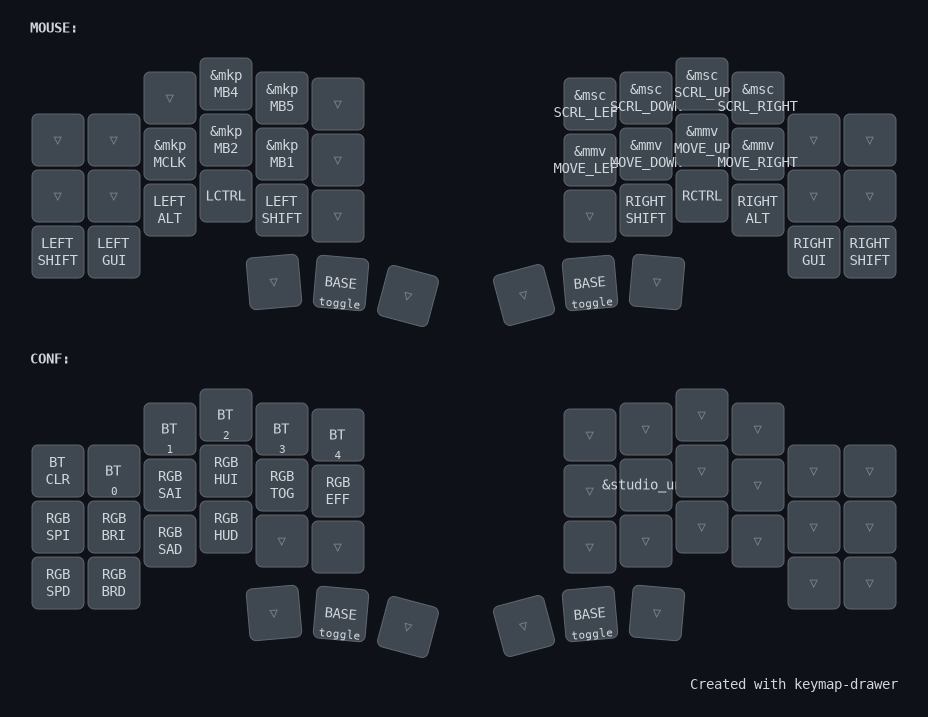

# ZMK config for Piantor (42 Keys Split Keyboard)

## BASE

- Timeless Home Row Mods

## Symbols and Numbers

- layout designed by consideren good keys for most used symbols in programming and intuitiv grouping
- number arrangement unchanged from normal keyboards
- left hand:
    - brackets cluster
- right hand
    - logic cluster on index finger (!,=,|,&)
    - arithmetic symbols on home row (=,+,*,-)

## Move

- arrow keys on h,j,k,l
- F-Keys (lil' wonky with F11, and F12 but works for me)
- Media keys

## Mouse and Config

- mouse emulation 
- switching bluetooth profiles and rgb setting

## TODO
- [ ] mouse speed modification for better precision and speed
- [ ] layer for gaming/gamedev (no home row mods, space bar)

